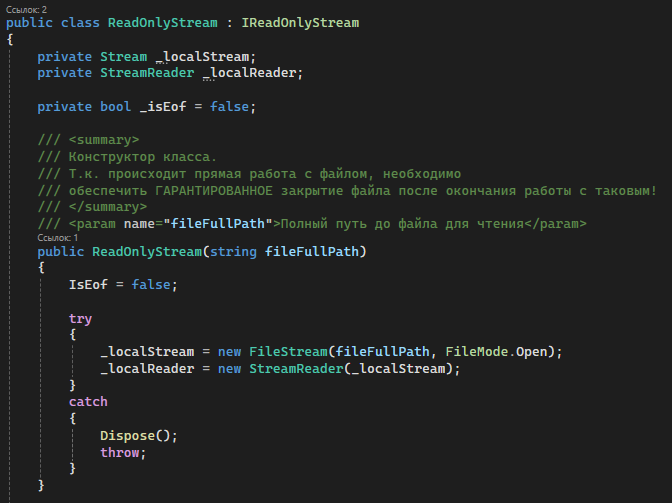
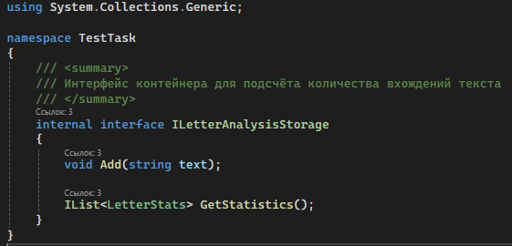
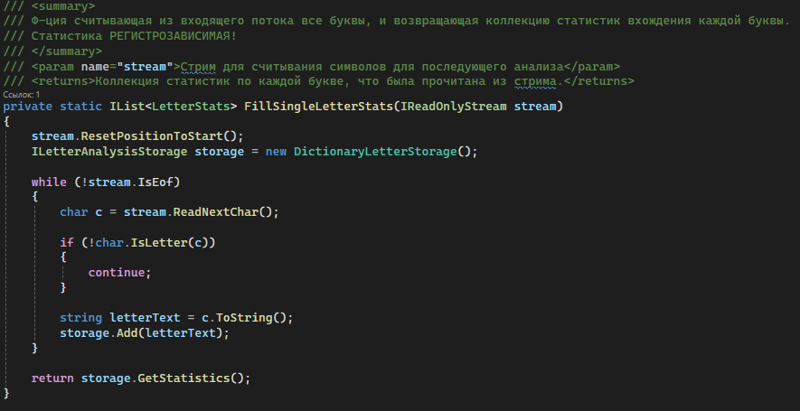
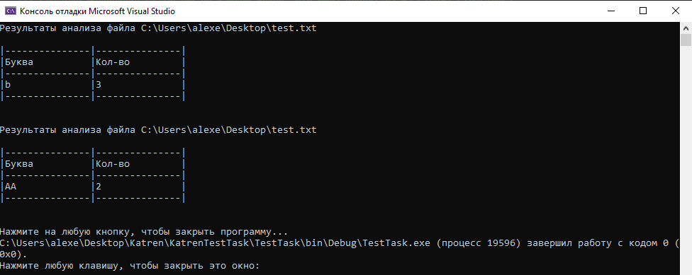
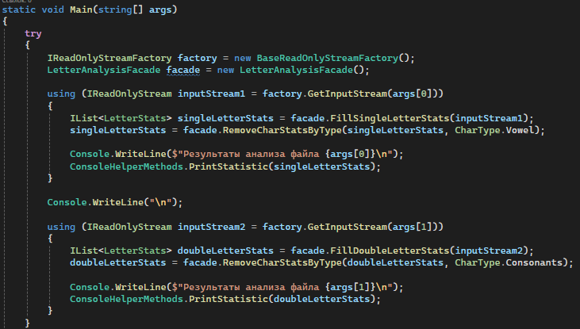
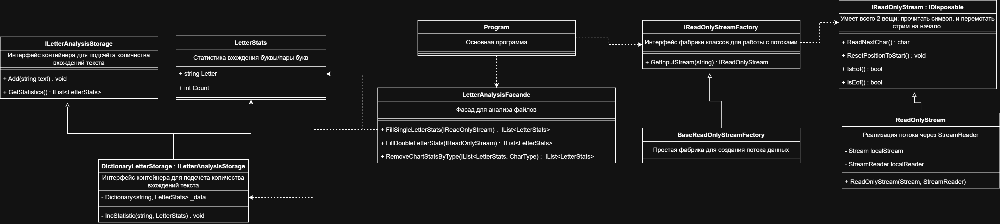
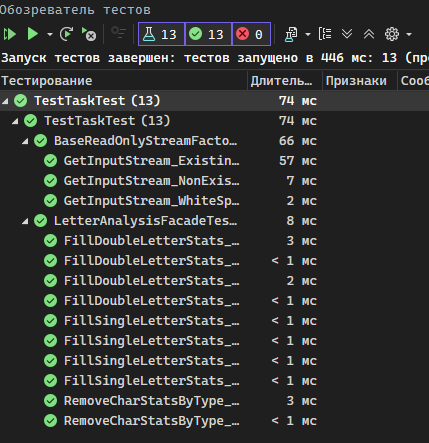

# Тестовое задание.
```
Доброго дня.  
Данный репозиторий представляет из себя тестовое задание для выполнения перед собеседованием на вакансию разработчика C# в компанию Катрен.

Репозиторий уже содержит основные классы и методы для последующей разработки.  
Большая часть уже описаных методов - _заглушки_, требующие реализации.  

Все методы/классы документированы и описывают своё предназначение и требуемое поведение.  
Таким образом, чтобы понять что именно данный метод должен делать - достаточно внимательно прочитать его документацию.  

Все места, требующие реализации, помечены _TODO_ маркером. Всего таких мест 9 шт.  
Все _TODO_ маркеры можно найти нажатием _"Ctrl+W, T"_ (Visual Studio 2017) или любым другим удобным для Вас способом.  

Исходный код содержит ошибки/недоработки, которые необходимо исправить каким-либо способом процессе разработки.   

В рамках разработки не запрещается как-либо модифицировать уже существующий код.  
А именно допускается: создание/удаление/модификация  методов/классов/структур и т.д., если этого требует ваша реализация.   

__Для разработки настоятельно рекомендуется сделать Fork данного проекта.  
И по готовности результат отдать на ревью методом Pull Request'a.__  

Если данный способ по каким-то причинам Вам не представляется реализуемым, можете выслать результат в виде архива на почту кадровому агенту.  
```
# Обзор проекта.

**Тип проекта** - консольное приложение с версией .NET фреймворка 4.6.1. <br>
**Назначение (кратко)** - консольное приложение, анализирующее содержимое файла через обертку ReadOnlyStream и выводящее результаты анализа в консоль. <br>
**Ввод** - название файлов, передаваемых через аргументы командой строки. <br>
**Вывод** - статистика вхождений одиночных элементов в первом файле, а также количество повторяющихся элементов во втором файле. <br>
**Узкие места проекта** - *синхронное* чтение файлов без полной загрузки в память.

# План:
1. Реализация синхронной обертки чтения файлов - ReadOnlyStream с обработкой ошибок.
2. Реализация логики анализа статистики анализа вхождений (скорее всего с помощью Dictionary<string, struct>).
3. Оформление структурированного вывода в консоль.
4. Написание Unit-тестов (если останется время).*

# Реализация:

### Обертка над потоком данных файла.
Принял решение реализовать чтение в ReadOnlyStream через StreamReader, чтобы не мучаться с кодировкой и с проблемами, когда, например, файл повреждён.



Очистку стримов решил реализовать через IDisposable интерфейс и вызов Close у обоих потоков.

### Реализация логики анализа статистики вхождений.
Для реализации хранилища статистики создал специальный интерфейс, подразумевающий разные реализации.



Для подсчёта количества букв использовал реализацию со словарём, так как у него низкое время поиска элементов + у нас может быть не такое большое количество разных элементов, чтобы беспокоиться о коллизиях.



**Есть сомнения насчёт логики подсчёта элементов, реализовал её, как просто подсчёт количества подряд идущих повторяющихся букв. Например, для файла с текстом "нНн" результатом будет 2.** 

### Работа с консолью.

Сделал красивый вывод с помощью таблицы и с использованием PadRight.



### Рефакторинг.

Исходные методы имели модификатор private static, тем самым исключая любую возможность их переиспользования в других программах. Также создание объектов внутри конструктора является не очень хорошей практикой, поэтому метод создания ReadOnlyStream был переенсён в отдельную фабрику. <br>

По итогу были совершены следующие изменения:
1. Вынесены методы, занимающиеся анализом файла через IReadOnlyStream в отдельный LetterAnalysisFacade. Почему не в ReadOnlyStream? Потому что данные методы узконаправлены и выходят за текущий интерефейс.
2. Метод GetInputStream(string) вынесен в отдельную фабрику IReadOnlyStreamFactory с инъекцией зависимостей.
3. Метод PrintStatistics(IList\<LetterStats\>) вынесен в метод ConsoleHelperMethods. Почему сделан static? Потому что метод имеет чёткую привязку к среде выполнения и не меняет внутреннее состояние каких-либо объектов.



### Диаграмма классов.

Была составлена дигарамма классов для удобства других разработчиков.



### Unit тесты.

Для создания Unit тестов был создан дополнительный проект TestTaskTest. Для Unit тестирования был выбран фреймворк NUnit, потому что только с этим фреймворком я знаком достаточно, чтобы использовать его в production.
<br><br>
В результате были реализованы тесты для основных алгоритмов в проекте

